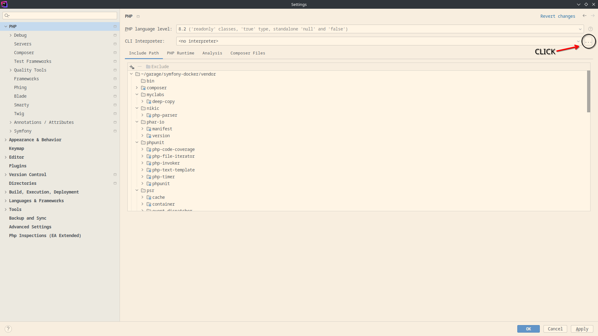
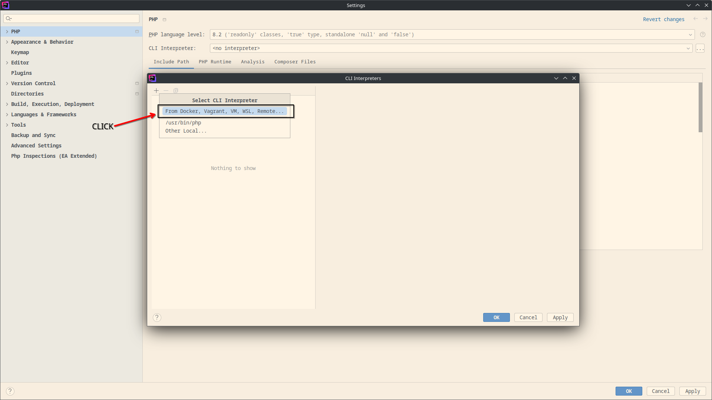
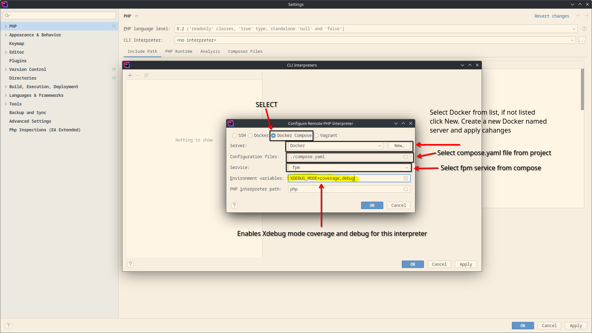
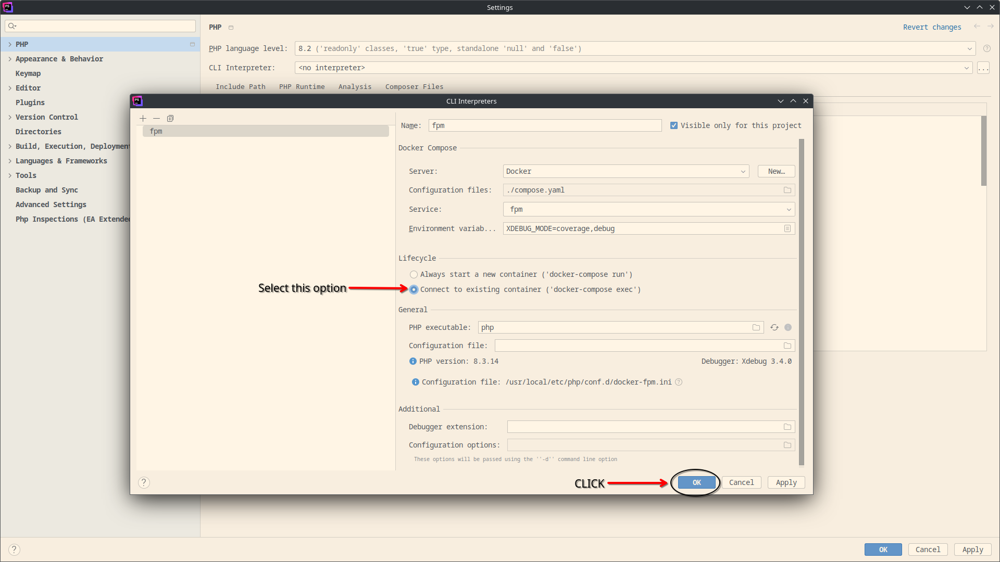
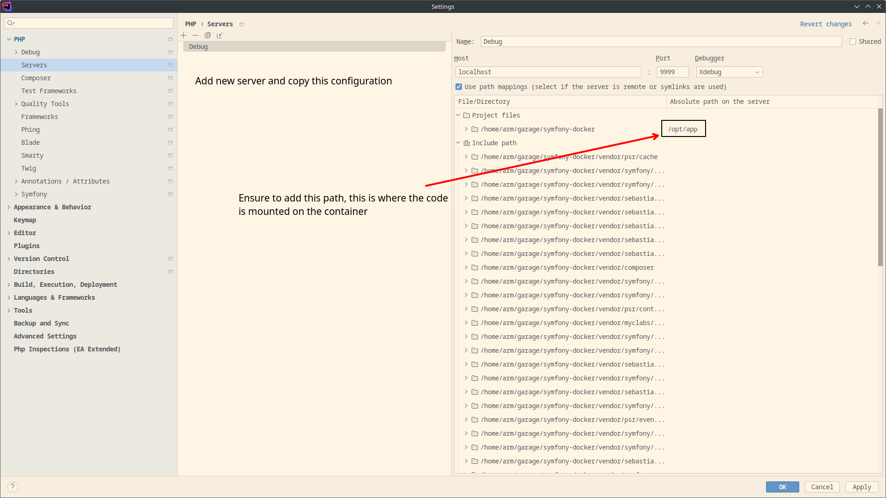

# symfony docker

### Management

To manage the project you have a Makefile with next recipes:

1. `build`: build all the docker stuff needed to run the service
1. `start`: starts the services containers. Fails if containers not exist.
   1.`start/debug` start container with Xdebug enabled.
1. `stop`: stop the services containers
1. `up`: creates containers and volumes for the services
1. `down`: deletes containers and volumes for the services
1. `bash`: starts a bash shell on the fpm service container
1. `zsh`: starts a zsh shell on the fpm service container
1. `secrets/set`: add secret to the dev environment
1. `secrets/list`: list secrets for the dev environment
1. `migrate`: run migrations on the database
1. `test`: run phpunit test. You have variants to run diferents test suites. `test/unit`, `test/integration` and `test/functional` run respective suites.
1. `format`: run php-cs-fixer to follow PER-CS 2.0
1. `analyse`: use phpstan to make static code analysis

### Project Structure

1. `resources`: contains all the configurations files and stuff nedded to run the application locally (docker files, configuration for php tools, also very static information like migrations, documentation)
1. `src`: contains all the source code of the application
1. `tests`: contains all the tests of the application

### Debug with Jetbrains IDE (phpstorm & idea)

To set up the IDE with Xdebug inside the container you need to configure PHP Interpreter, follow images:

> On Idea editor you need to search PHP extensions and config under Langaguages & Frameworks

To be able to debug, in the request you may add a query parameter setting XDEBUG_SESSION_START to make the editor stop on
the breaking point.

Ensure to start the container with the `start/debug` command to enable Xdebug.
